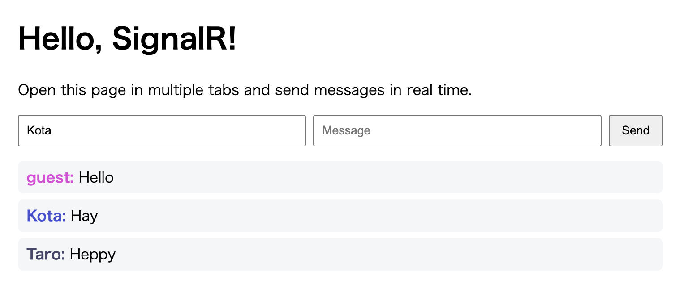

# Hello World (SignalR)

A simple real-time Hello World chat application using ASP.NET Core SignalR.

## Features

- **ASP.NET Core SignalR** — Real-time bidirectional communication over WebSockets/fallback transports
- **Hub-based messaging** — Broadcast messages to all connected clients through `ChatHub`
- **Browser client** — Simple static HTML page for quick local verification

## Requirements

- [.NET SDK](https://dotnet.microsoft.com/download)

## Build & Run

```sh
cd hello_signalr
dotnet run
```

Then open [http://localhost:5265](http://localhost:5265) in two or more browser tabs and send messages.

## Stop

Press `Ctrl+C` in the terminal to stop the server.

## Screenshot


